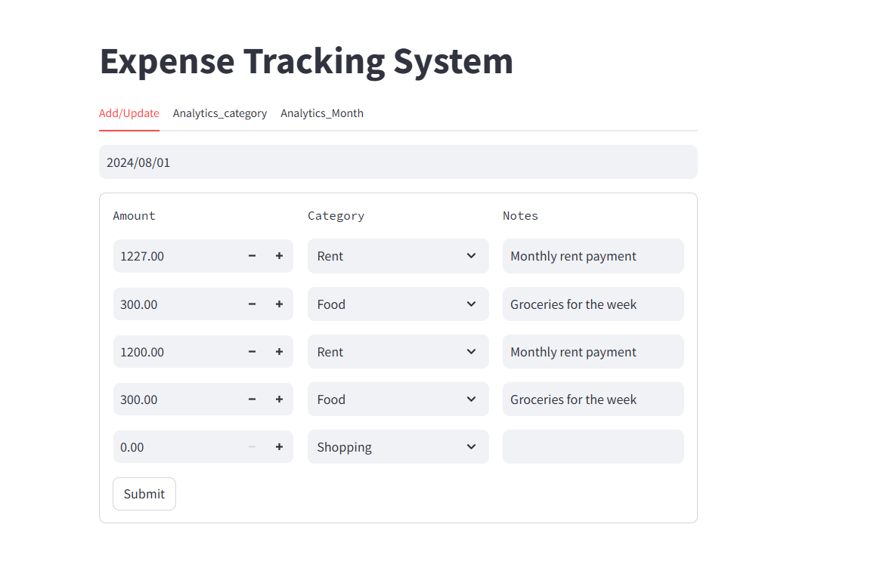
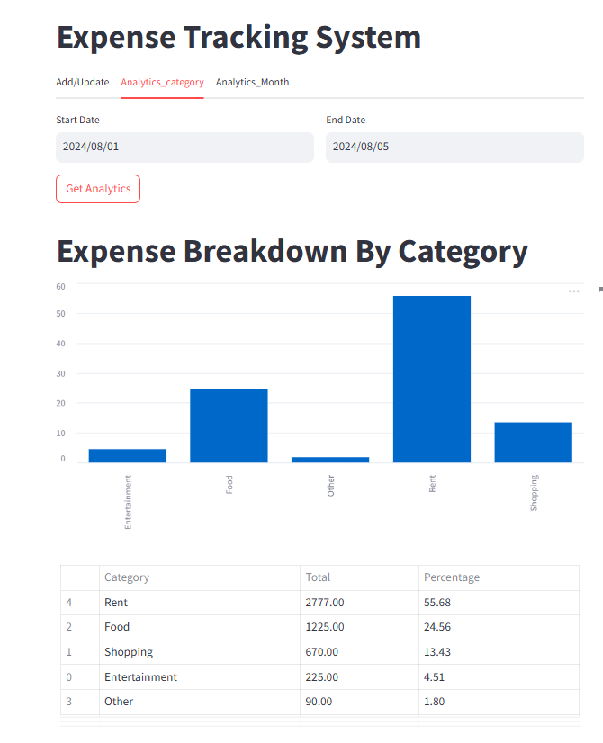
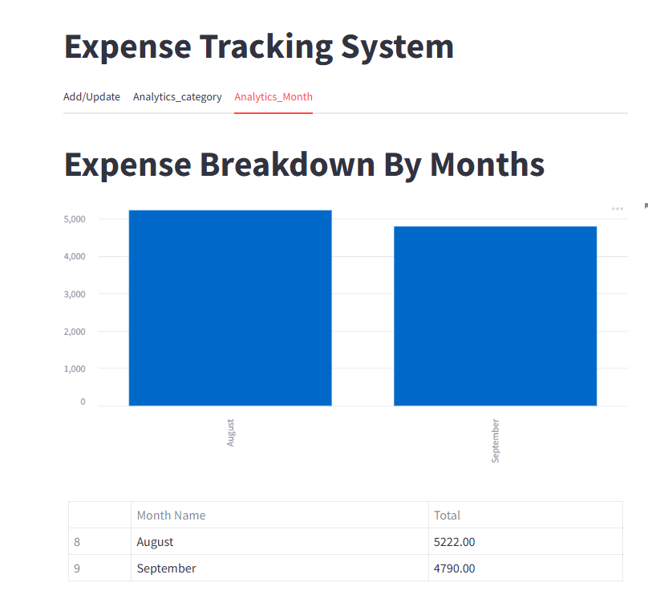

# 💰 Expense Management System

A simple and interactive expense management system built with **Streamlit** (frontend) and **FastAPI** (backend).

---

## 📁 Project Structure

```
.
├── frontend/          # Streamlit frontend app
├── backend/           # FastAPI backend server
├── tests/             # Unit tests
├── requirements.txt   # Dependencies
└── README.md          # Project documentation
```

---

## 🚀 Setup Instructions

1. **Clone the repository**:
   ```bash
   git clone https://github.com/trijesh61/expense-management-system.git
   cd expense-management-system
   ```

2. **Install dependencies**:
   ```bash
   pip install -r requirements.txt
   ```

3. **Run the FastAPI server**:
   ```bash
   uvicorn backend.server:app --reload
   ```

4. **Run the Streamlit app**:
   ```bash
   streamlit run frontend/app.py
   ```

---

## 📸 Screenshots

### 🔧 Add or Update Expenses


---

### 📊 Analytics by Category (with Date Filter)


---

### 📅 Monthly Expense Overview


---

## 📌 Features

- Add & update expenses with category and notes
- Visual insights by **category** and **month**
- Clean FastAPI backend with RESTful endpoints
- User-friendly Streamlit interface
- Exportable analytics (charts & data)
- Modular and easy to extend

---

## 🧪 Testing

To run all tests using `pytest`:
```bash
pytest tests/
```

---

## 📬 Contact

For issues, suggestions, or contributions, feel free to open an [issue](https://github.com/trijesh61/expense-management-system/issues).

---
